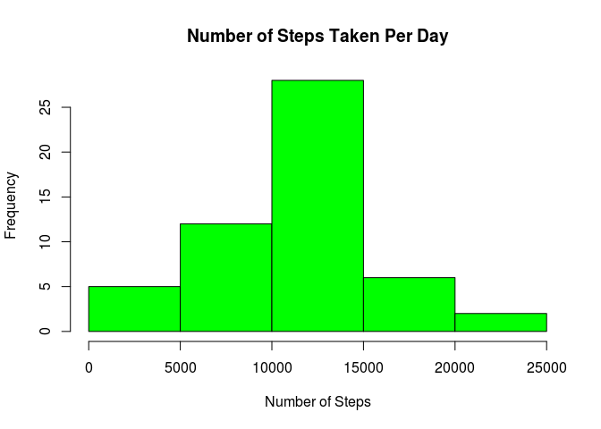
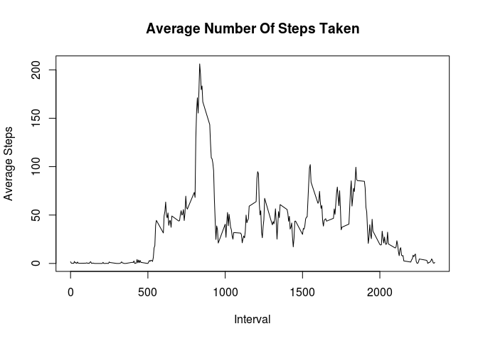
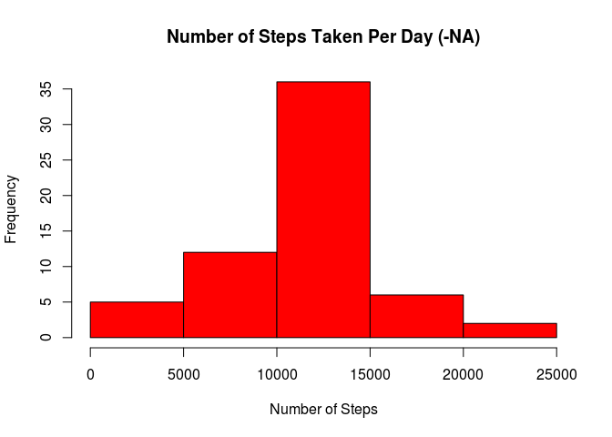
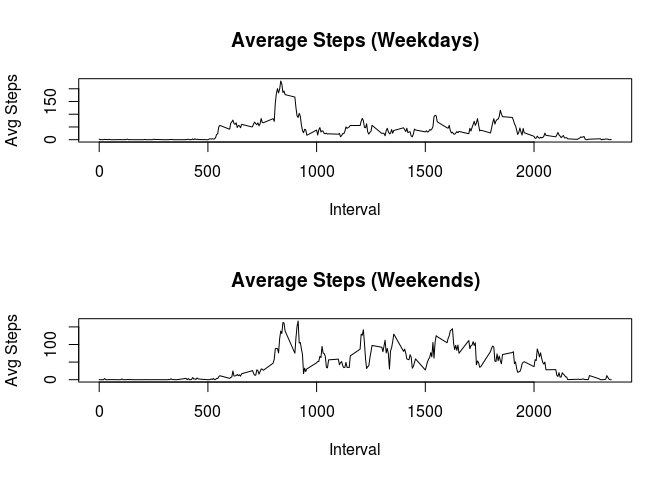

# Reproducable Research: Course Project 1
Alan Cash  
2 April 2016  

**Introduction**

This is my submission for the the first course project of the 'Reproducable Research' module. 

From the assignment brief:

"This assignment makes use of data from a personal activity monitoring device. This device collects data at 5 minute intervals through out the day. The data consists of two months of data from an anonymous individual collected during the months of October and November, 2012 and include the number of steps taken in 5 minute intervals each day.

The variables included in this dataset are:

steps: Number of steps taking in a 5-minute interval (missing values are coded as NA)

date: The date on which the measurement was taken in YYYY-MM-DD format

interval: Identifier for the 5-minute interval in which measurement was taken

The dataset is stored in a comma-separated-value (CSV) file and there are a total of 17,568 observations in this dataset."

**Loading and preprocessing the data**


```r
library(timeDate)
x <- read.csv("activity.csv")
x$date <- as.Date(x$date,"%Y-%m-%d")
y <- aggregate(steps~date,x,sum)
```
The above code loads the necessary libraries and imports the dataset. The 'date' variable is made explicit and an aggregate is taken of the sum number of steps per date. 


**What is mean total number of steps taken per day?**


```r
hist(y$steps, main = "Number of Steps Taken Per Day", 
     xlab = "Number of Steps", col = "green")
```



The histogram demonstrates that between 10,000 and 15,000 is the most frequently occuring total number of steps per day. The mean and median values are:


```r
round(mean(y$steps), digits = 2)
```

```
## [1] 10766.19
```

```r
round(median(y$steps), digits = 2)
```

```
## [1] 10765
```


**What is the average daily activity pattern?**

Firstly an aggregate is taken of the mean number of steps by interval:


```r
z <- aggregate(steps~interval,x,mean)
```

From this aggregate a time series plot can be generated:


```r
plot(z$interval, z$steps, type = "l", 
     main = "Average Number Of Steps Taken", 
     xlab = "Interval", ylab = "Average Steps")
```




```r
z[which.max(z$steps),]
```

```
##     interval    steps
## 104      835 206.1698
```

The above code determines which is the 5-minute interval that, on average, contains the maximum number of steps. 


**Imputing missing values**

The following establishes that there are **2304** missing values in the dataset.


```r
sum(is.na(x))
```

```
## [1] 2304
```

As we have already established the mean number of steps per interval, we can then use these to impute the missing values. Firstly we merge the two dataframes and then replace the NA values in one column with the corresponding average steps by interval value in the other:


```r
xmerge <- merge(x,z,by = "interval")

xmerge$steps.x[which(is.na(xmerge$steps.x))] <- 
        xmerge$steps.y[which(is.na(xmerge$steps.x))]
```

We can then generate a new aggregate using the imputed data set and generate a new histogram.


```r
newy <- aggregate(steps.x~date,xmerge,sum)
```


```r
hist(newy$steps.x, main = "Number of Steps Taken Per Day (-NA)", 
     xlab = "Number of Steps", col = "red")
```




```r
round(mean(newy$steps.x), digits = 2)
```

```
## [1] 10766.19
```

```r
round(median(newy$steps.x), digits = 2)
```

```
## [1] 10766.19
```

We can see that, as would be expected, the mean value has remained the same. The median value has altered however.

This is an expected outcome when using the mean to impute missing values and the method is not recommended for any analysis from which you which to make inferences. It will however suffice in this instance.  

More on this topic can be found here: http://www.theanalysisfactor.com/mean-imputation/

**Are there differences in activity patterns between weekdays and weekends?**

The following code uses the timeDate library to establish which of the date values are weekdays vs weekends, generating a logical vector. These are then replaced with two factors of 'Weekday' and 'Weekend'.


```r
xmerge$wd <- isWeekday(xmerge$date, wday = 1:5)
xmerge$wd[which(xmerge$wd == FALSE)] <- "Weekend"
xmerge$wd[which(xmerge$wd == TRUE)] <- "Weekday"
xmerge$wd <- as.factor(xmerge$wd)
```

We can then use this factor to split the dataframe and aggregate the mean number of steps by interval for each subset:


```r
wds <- aggregate(steps.x~interval, xmerge[which(xmerge$wd == "Weekday"),], mean)
wends <- aggregate(steps.x~interval, xmerge[which(xmerge$wd == "Weekend"),], mean)
```

Finally we can generate a plot to demonstrate the differences between the average number of steps taken during weekdays and weekends.


```r
par(mfrow=c(2,1))
plot(wds$interval,wds$steps.x, type = "l", main = "Average Steps (Weekdays)", xlab = "Interval", ylab = "Avg Steps")
plot(wends$interval,wends$steps.x, type = "l", main = "Average Steps (Weekends)", xlab = "Interval", ylab = "Avg Steps")
```




```r
mean(wds$steps.x)
```

```
## [1] 35.61058
```

```r
mean(wends$steps.x)
```

```
## [1] 42.3664
```

The plot and the above averages demonstrate that more steps are generally taken at the weekends, and that these take place throughout the day rather peaking early on. We could hypothesise that the individual either walks to work or takes a run in the mornings prior to working at a desk throughout the day, and perhaps enjoys outdoor activities during the weekend afternoons. 
